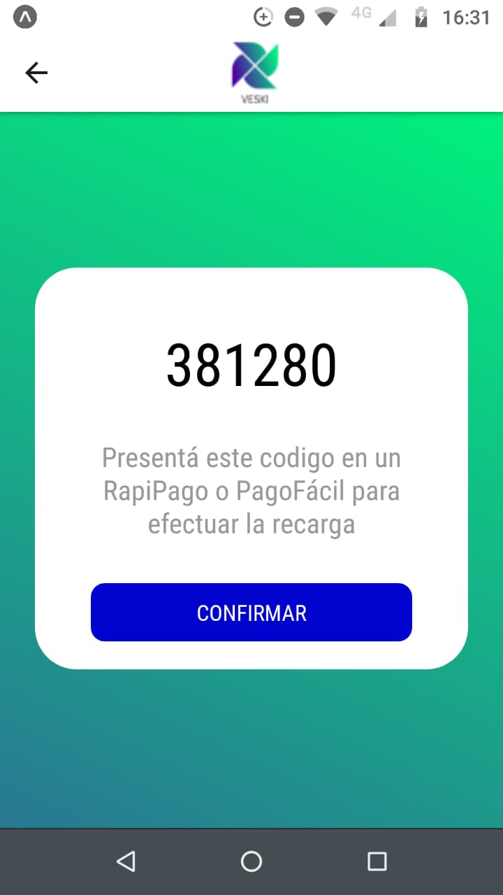

      <h1>VESKI APP</h1> 

    Veski App es una billetera electrónica, que te ayudará a gestionar tu dinero. Podrás realizar transferencias, recibir dinero e incluso obtener registro de tus movimientos y las estadisticas de gastos generados en los últimos días. Todo esto en base a una cuenta que crearás al momento de registrarte en nuestra app. A partir de allí, podrás disfrutar de todas las funcionalidades mencionadas anteriormente. A continuación, presentamos un resumen visual de nuestra aplicación.

    <h1>HOME & LOGIN</h1> 
    </img>
    <h1>REGISTRO </h1> 
    <h2>PASO 1 - REGISTRO INICIAL</h2> 
    
Sólo deberás ingresar un e-mail y contraseña para iniciar el registro.

    </img>
    <h2>PASO 2 - VALIDA EL CODIGO</h2> 
    
Una vez finalizado el primer paso, te enviaremos un correo electrónico con un código que utilizarás para validar tu cuenta.

    </img>
    <h2>PASO 3 - DAR ALTA A TU CUENTA</h2> 
    
 Luego de ingresar el código, deberás completar el formulario con tus datos personales.

    </img>
    <h2>PASO 4 - LOGIN</h2> 
    
Finalmente ya puedes logearte con tu email y contraseña registrados. Ahora puedes disfrutar de Veski.

    </img>

    <h1>INICIO</h1>
    

        Una vez que inicies sesion, podrás empezar a navegar y explorar todas las funcionalidades que tenemos para ti
    

    </img>
    <h1>RECARGAR DINERO</h1> 
    

        Recarga dinero a tus cuentas por medio de tarjeta crédito o débito, o a través de un codigo QR que puedes presentar en cualquier punto de Todo Pago.
    

    </img>
    <h2>TARJETA</h2>
    </img>
    <h2>CODIGO ELECTRONICO</h2>
    </img>
    <h1>ENVIAR DINERO</h1> 
    

        Enviar dinero a tus contactos. Puedes hacerlo desde cualquiera de tus cuentas siempre y cuando tengas saldo disponible.
    

    </img>
    <h1>MOVIMIENTOS Y ESTADISTICAS</h1>
    

  Puedes ver tus transacciones realizadas de acuerdo a tres tipos de datos especificados por periodo: mensual, semanal y diario, a través de un grafico. Asimismo tendrás información detallada de tus ultimos movimientos.
    

    <h2>ULTIMOS MOVIMIENTOS</h2>
    </img>
    <h2>ESTADISTICAS</h2>
    </img>

    <h1> COMO CORRER EL PROYECTO ? </h1>
        <ol>
        <li>Crea una base de datos  MySQL en XAMPP. En este ejemplo le pondremos "veski"</li>
        <li>Crea un archivo dentro de la carpeta "api" llamado .env con el siguiente contenido:
            <pre>
                    <code>
                        DB_HOST=127.0.0.1
                        DB_USER=root
                        DB_PASSWORD=
                        DB_NAME=veski
                        EMAIL_USER=veski.app@gmail.com
                        EMAIL_PASSWORD=pass@word1
                    </code>
            </pre>
        </li>
        <li>Crea un archivo dentro de la carpeta "client" llamado env.js con el siguiente contenido:
            <pre>
                    <code>
                        export const API = `http://ipv4DeTuPC:3000`;
                    </code>
            </pre>
        </li>
        <li>Posicionate en la carpeta api y ejecuta el comando npm install</li>
        <li>Posicionate en la carpeta native y ejecuta el comando install</li>
        <li>Correr los servers</li>
        <li>Abrí dos consolas</li>
        <li>En una consola posicionate en la carpeta api y ejecuta el comando npm run tables y luego npm run dev</li>
        <li>En la otra consola, posicionate en la carpeta client y ejecuta el comando expo start</li>
        <li>Abre tu app de expo de tu celular y escanea el codigo QR </li>
        </ol>

    <h1> TECNOLOGIAS USADAS </h1>
        <h2>FRONTEND</h2>
        <ul>
            <li>React Native</li>
            <li>Axios</li>
        </ul>
        <h2>BACKEND</h2>
        <ul>
            <li>Nodejs</li>
            <li>MoleculerJS</li>
            <li>Mysql</li>
            <li>Nodemailer</li>
        </ul>

    <h1> EQUIPO </h1>
    
El equipo de este proyecto está conformado por los siguientes desarrolladores:

        <ul>
            <li><a href="https://github.com/shiberus" rel="nofollow">Santiago Lopez Cane </a></li>
            <li><a href="https://github.com/delfinalago" rel="nofollow">Delfina Lago </a></li>
            <li><a href="https://github.com/nahuelcaputto" rel="nofollow">Nahuel Caputto</a></li>
            <li><a href="https://github.com/matiasLires" rel="nofollow">Matias Lires</a></li>
            <li><a href="https://github.com/gsegovia2012" rel="nofollow">Gimena Segovia</a></li>
            <li><a href="https://github.com/FernandezCamila" rel="nofollow">Camila Fernandez </a></li>
        </ul>

