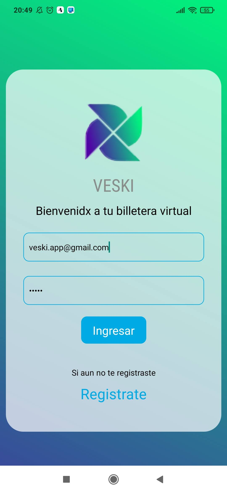
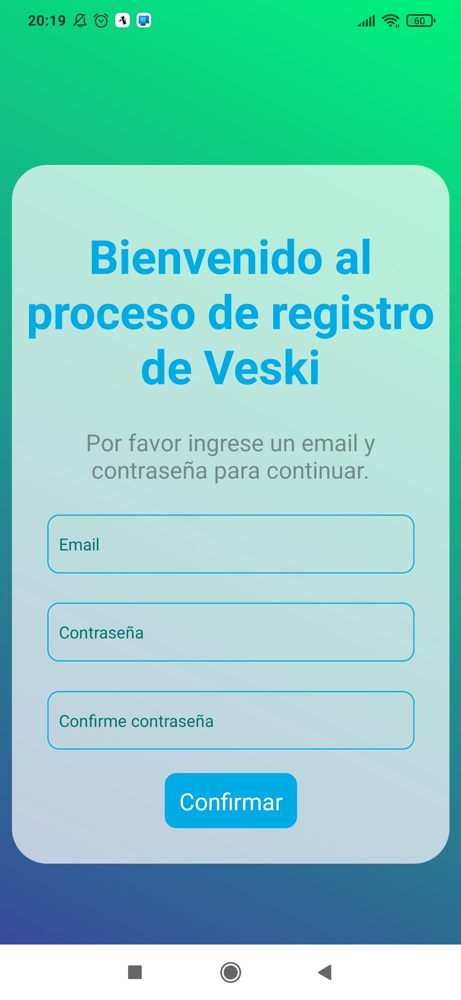
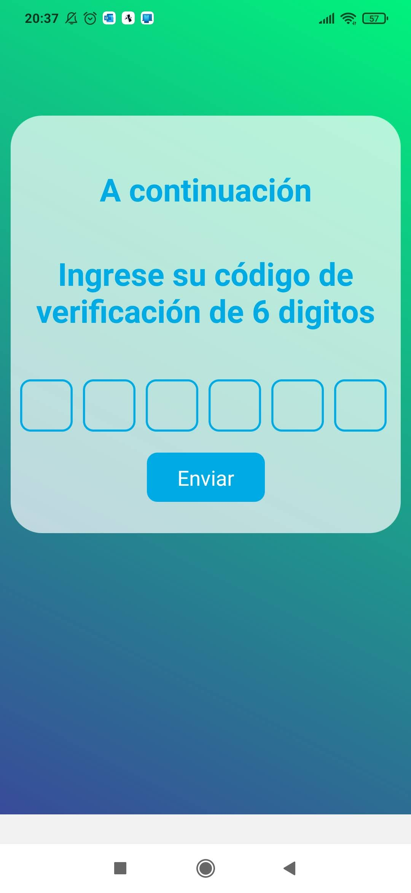
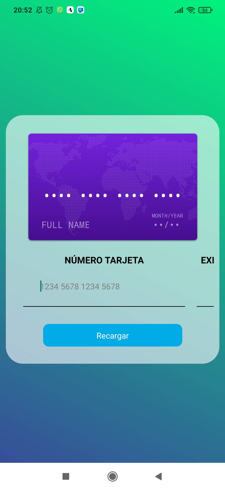
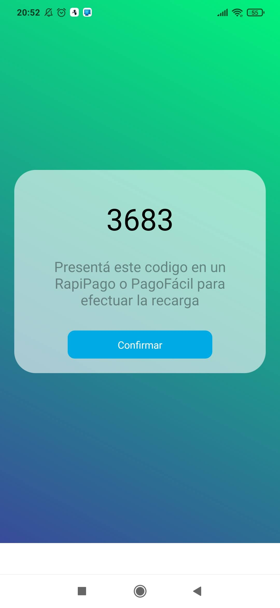
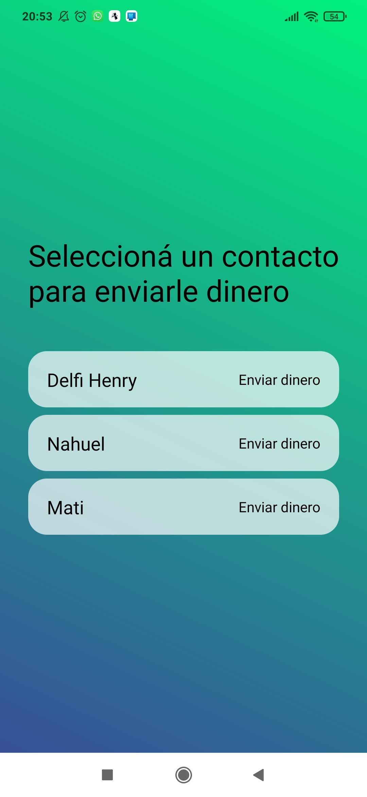
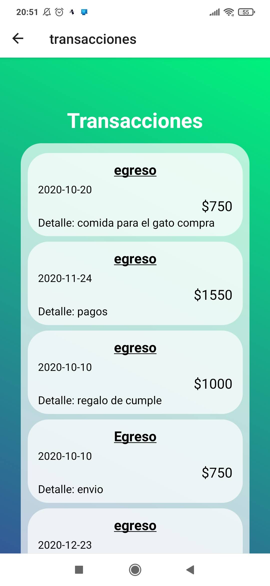
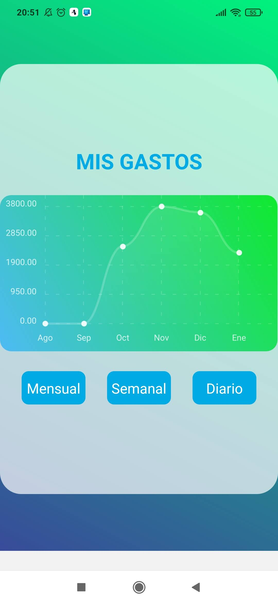

<h1>Veski App</h1> 

    Veski App es una billetera electronica, que te ayudara a gestionar tu dinero, podras enviar dinero, recibir y hasta ver tu movimientos y estadisticas de los ultimos dias. Todo esto en base a una cuenta que creas cuando te registras en nuestra app.  A partir de ahi, podras disfrutar de todas las funcionalidades que te mencionamos ya. A continuacion te mostramos un resumen visual de nuestra aplicacion.

    <h1>HOME & LOGIN</h1> 
    </img>
    <h1>REGISTRO </h1> 
    <h2>PASO 1 - REGISTRO INICIAL</h2> 
    
Solo debes poner tus datos basicos para el registro.

    </img>
    <h2>PASO 2 - VALIDA EL CODIGO</h2> 
    
Una vez termines el paso uno, te enviaremos un correo electronico con el codigo correspondiente.

    </img>
    <h2>PASO 3 - DAR ALTA A TU CUENTA</h2> 
    
Una vez valides tu codigo, tendras que completar un ultimo paso. Llena el formulario con los datos complementarios.

    </img>
    <h2>PASO 4 - LOGIN</h2> 
    
Finalmente ya puedes logearte con tu email y contraseña registrados, ahora puedes disfrutar de Hbank.

    </img>

    <h1>INICIO</h1>
    

        Una vez inicies session, podras empezar a navegar y explorar todas las funcionalidades que tenemos para ti
    

    </img>
    <h1>RECARGAR DINERO</h1> 
    

        Recarga dinero a cualquiera de tus dos cuentas por medio de tarjeta credito o deboto, o atravez de un codigo QR que presentaras en cualquier punto de Todo Pago.
    

    <h2>TARJETA</h2>
    </img>
    <h2>CODIGO ELECTRONICO</h2>
    </img>
    <h1>MANDAR DINERO</h1> 
    

        Mandar dinero a tus contactos. Puedes hacerlo desde cualquiera de tus cuentas siempre y cuando tengas saldo disponible.
    

    </img>
    <h1>MOVIMIENTOS Y ESTADISTICAS</h1>
    

        Puedes ver tus ultimos movimientos en los ultimos 15 y 7 dias, asi como los que realizaste el mismo dia. de igual manera tendras informacion un poco mas especifica, ya que contaras con una opcion de estadisticas, en las cuales te muestraremos como fue el comportamiento de tu dienro, en el trascurso de los ultimos 7 dias encuanto a ingreso y egresos.
    

    <h2>ULTIMOS MOVIMIENTOS</h2>
    </img>
    <h2>ESTADISTICAS</h2>
    </img>

    <h1> COMO CORRER EL PROYECTO ? </h1>
        <ol>
        <li>Crea una base de datos  MySQL en XAMPP. En este ejemplo le pondremos "veski"</li>
        <li>Crea un archivo dentro de la carpeta "api" llamado .env con el siguiente contenido:
            <pre>
                    <code>
                        DB_HOST=127.0.0.1
                        DB_USER=root
                        DB_PASSWORD=
                        DB_NAME=veski
                        EMAIL_USER=veski.app@gmail.com
                        EMAIL_PASSWORD=pass@word1
                    </code>
            </pre>
        </li>
        <li>Crea un archivo dentro de la carpeta "client" llamado env.js con el siguiente contenido:
            <pre>
                    <code>
                        export const API = `http://ipv4DeTuPC:3000`;
                    </code>
            </pre>
        </li>
        <li>Posicionate en la carpeta api y ejecuta el comando npm install</li>
        <li>Posicionate en la carpeta native y ejecuta el comando install</li>
        <li>Correr los servers</li>
        <li>Abrí dos consolas</li>
        <li>En una consola posicionate en la carpeta api y ejecuta el comando npm run tables y luego npm run dev</li>
        <li>En la otra consola, posicionate en la carpeta client y ejecuta el comando expo start</li>
        <li>Abre tu app de expo de tu celular y escanea el codigo QR </li>
        </ol>

    <h1> TECNOLOGIAS USADAS </h1>
        <h2>FRONTEND</h2>
        <ul>
            <li>React Native</li>
            <li>Axios</li>
        </ul>
        <h2>BACKEND</h2>
        <ul>
            <li>Nodejs</li>
            <li>MoleculerJS</li>
            <li>Mysql</li>
            <li>Nodemailer</li>
        </ul>

    <h1> EQUIPO </h1>
    
El equipo de desarrollo lo conforman los siguientes desarrolladores:

        <ul>
            <li><a href="https://github.com/shiberus" rel="nofollow">Santiago Lopez Cane </a></li>
            <li><a href="https://github.com/delfinalago" rel="nofollow">Delfina Lago </a></li>
            <li><a href="https://github.com/nahuelcaputto" rel="nofollow">Nahuel Caputto</a></li>
            <li><a href="https://github.com/matiasLires" rel="nofollow">Matias Lires</a></li>
            <li><a href="https://github.com/gsegovia2012" rel="nofollow">Gimena Segovia</a></li>
            <li><a href="https://github.com/FernandezCamila" rel="nofollow">Camila Fernandez </a></li>
        </ul>

